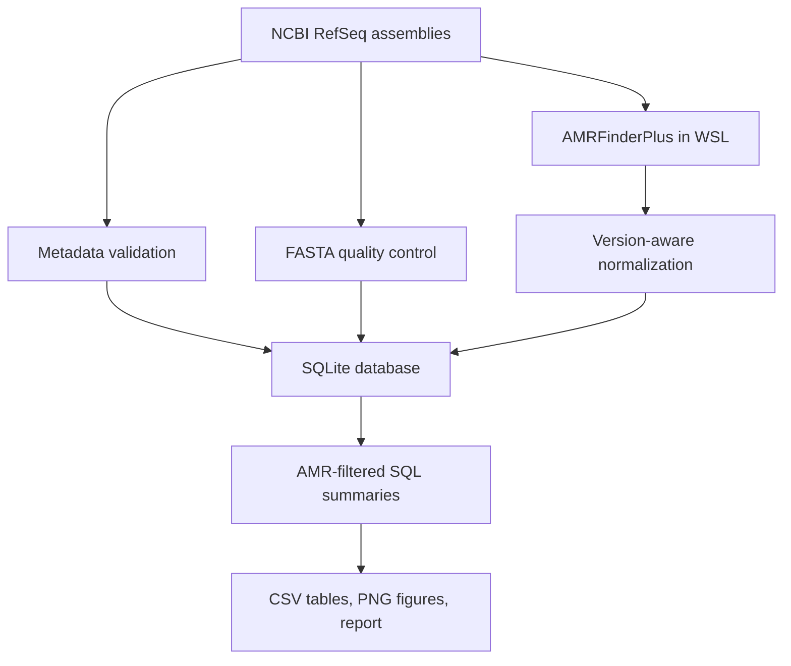
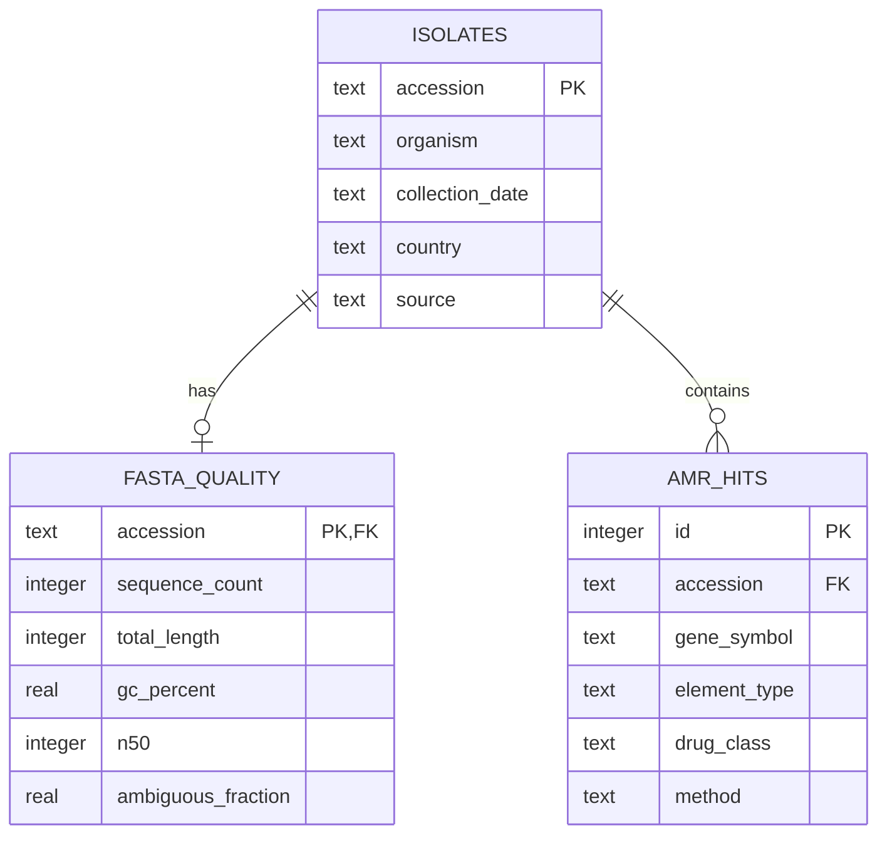

# Microbial AMR Genomics Pipeline

[](https://www.python.org/)
[](#testing)
[](https://github.com/ncbi/amr)
[](#project-status)

A reproducible, end-to-end bioinformatics pipeline for exploring antimicrobial-resistance-associated elements in public *Escherichia coli* genome assemblies.

The project downloads assemblies and BioSample metadata from NCBI, calculates FASTA quality metrics, normalizes version-dependent AMRFinderPlus output, stores linked results in SQLite, and generates analysis-ready tables, figures, and a Markdown report.

> [!IMPORTANT]
> This is an independent educational analysis using public assembled genomes. Detected genomic determinants do not prove phenotypic resistance, and the results must not be used for diagnosis, treatment decisions, or population-level prevalence estimates.

## Why this project exists

Public-health genomic workflows combine biological data, command-line tools, data validation, databases, and reproducible reporting. This project demonstrates those skills in one traceable system while answering a focused question:

> What AMR-associated genes, mutations, and drug-class labels are detected by AMRFinderPlus in a small pilot set of public *E. coli* RefSeq assemblies, and how can those findings be processed and summarized reproducibly?

## Pipeline overview



Every record is linked by its NCBI assembly accession, preventing metadata, genome-quality measurements, and AMR results from being assigned to the wrong isolate.

## Implemented features

- NCBI Datasets-based assembly and BioSample metadata acquisition
- FASTA parsing with Biopython
- Sequence count, total length, mean length, GC content, N50, and ambiguous-base fraction
- AMRFinderPlus batch execution from WSL/Linux
- Compatibility with both legacy and current AMRFinderPlus TSV headers
- Missing-value normalization and metadata schema validation
- Relational SQLite schema with primary keys, foreign keys, checks, and indexes
- Idempotent metadata/QC upserts and transactional replacement of detection records
- Explicit filtering of `AMR` results from `--plus` stress and virulence findings
- Isolate-, gene-, and drug-class-level aggregation
- Headless Matplotlib/Seaborn figure generation on Windows
- Automated Markdown report generation
- Six deterministic tests using small synthetic fixtures

## Pilot dataset and results

The completed pilot run used ten complete *E. coli* RefSeq assemblies selected through NCBI Datasets. This is a convenience sample for workflow development—not an epidemiologically representative cohort.

| Measure | Observed result |
|---|---:|
| Assemblies | 10 |
| Countries represented | Belgium (6), USA (3), Colombia (1) |
| Genome-length range | 4.76–5.56 Mb |
| GC-content range | 50.41–51.11% |
| FASTA records per assembly | 1–4 |
| Distinct AMR-associated symbols | 47 |
| AMRFinder drug-class labels | 14 |
| Unique AMR elements per isolate | 4–25 |
| Drug classes per isolate | 2–9 |

The most widely detected elements included `blaEC` and `mdtM` in 10/10 assemblies, `acrF` in 9/10, and `sul2` in 5/10. Several notable beta-lactamase-associated symbols—including `blaCTX-M-15`, `blaKPC-2`, `blaNDM`/`blaNDM-1`, and `blaOXA-9`—appeared in one assembly each.

These are presence-level genomic findings. Allele naming, genomic context, copy number, expression, and laboratory antimicrobial-susceptibility testing require separate interpretation.

## Technology stack

| Component | Purpose |
|---|---|
| Python 3.12 | Pipeline orchestration and analysis |
| Biopython 1.85 | FASTA parsing |
| Pandas 2.3.1 | Validation, normalization, and tabular analysis |
| SQLite | Relational persistence and SQL aggregation |
| Matplotlib 3.10.3 / Seaborn 0.13.2 | Reproducible figures |
| NCBI Datasets/dataformat 18.34.0 | Assembly and metadata acquisition |
| AMRFinderPlus 4.2.7 | AMR, stress, and virulence element detection |
| AMRFinder database 2026-05-15.1 | Versioned reference catalogue |
| WSL2 / Ubuntu | Linux environment for AMRFinderPlus |
| pytest 8.4.1 | Automated testing |

## Repository structure

```text
ecoli-genomic-surveillance/
├── config/
│   └── project.yaml
├── data/
│   ├── raw/                    # downloaded inputs (not committed)
│   ├── interim/                # AMRFinderPlus TSV files
│   └── processed/              # generated SQLite database
├── docs/
│   ├── DATA_DICTIONARY.md
│   └── WORKFLOW.md
├── outputs/
│   ├── figures/
│   ├── reports/
│   └── tables/
├── scripts/
│   ├── download_ncbi_data.ps1
│   ├── initialize_database.py
│   ├── run_amrfinderplus.sh
│   └── run_pipeline.py
├── src/genomic_surveillance/
│   ├── amr_parser.py           # version-aware AMRFinder parsing
│   ├── analysis.py             # SQL summaries, CSVs, and plots
│   ├── database.py             # schema and transactional loading
│   ├── fasta_qc.py             # FASTA validation and QC metrics
│   ├── metadata.py             # metadata schema normalization
│   └── reporting.py            # Markdown report generation
├── tests/
│   ├── fixtures/
│   ├── test_amr_parser.py
│   ├── test_database.py
│   ├── test_fasta_qc.py
│   └── test_metadata.py
├── pyproject.toml
└── requirements.txt
```

## Installation

### 1. Set up the Python environment on Windows

```powershell
git clone https://github.com/Xenox-cloud/ecoli-genomic-surveillance.git
cd ecoli-genomic-surveillance

py -3.12 -m venv venv
.\venv\Scripts\Activate.ps1

python -m pip install --upgrade pip
python -m pip install -r requirements.txt
python -m pip install -e .
python -m pytest
```

Using `python -m pytest` ensures that pytest runs with the currently active virtual environment instead of a stale global launcher.

### 2. Install NCBI Datasets

Download `datasets.exe` and `dataformat.exe` from the [official NCBI Datasets releases](https://ftp.ncbi.nlm.nih.gov/pub/datasets/command-line/v2/win64/) and place them on `PATH`.

Verify the installation:

```powershell
datasets version
dataformat tsv genome --help
```

### 3. Install AMRFinderPlus in WSL

AMRFinderPlus is run inside WSL/Linux while Python development remains on Windows.

```bash
conda create -n amrfinder -c conda-forge -c bioconda ncbi-amrfinderplus
conda activate amrfinder
amrfinder_update
amrfinder --version
amrfinder --database_version
```

## Data acquisition

The pilot selected ten complete, non-atypical, single-isolate RefSeq assemblies:

```powershell
New-Item -ItemType Directory -Force -Path .\data\raw

datasets summary genome taxon "Escherichia coli" `
  --assembly-level complete `
  --assembly-source RefSeq `
  --exclude-atypical `
  --exclude-multi-isolate `
  --limit 10 `
  --as-json-lines |
dataformat tsv genome --fields accession |
Select-Object -Skip 1 |
Set-Content -Encoding ascii .\data\raw\accessions.txt

datasets download genome accession `
  --inputfile .\data\raw\accessions.txt `
  --include genome `
  --filename .\data\raw\ncbi_ecoli.zip

Expand-Archive `
  -Path .\data\raw\ncbi_ecoli.zip `
  -DestinationPath .\data\raw `
  -Force
```

Extract the metadata fields supported by NCBI Datasets CLI 18.34.0:

```powershell
dataformat tsv genome `
  --package .\data\raw\ncbi_ecoli.zip `
  --fields accession,organism-name,assminfo-biosample-collection-date,assminfo-biosample-geo-loc-name,assminfo-biosample-isolation-source |
Set-Content -Encoding utf8 .\data\raw\metadata.tsv
```

NCBI field names can change across CLI versions. Use `dataformat tsv genome --help` and inspect available BioSample fields if a field is rejected.

## Running the workflow

### 1. Detect genomic elements with AMRFinderPlus

From WSL in the project directory:

```bash
conda activate amrfinder
bash scripts/run_amrfinderplus.sh \
  data/raw/ncbi_dataset/data \
  data/interim/amrfinder
```

The script creates one `${accession}_amrfinder.tsv` file per assembly. The `--plus` option also returns selected stress and virulence elements; downstream summaries deliberately restrict scientific AMR counts to `element_type = 'AMR'`.

### 2. Run the Python pipeline

From the activated Windows virtual environment:

```powershell
python .\scripts\run_pipeline.py `
  --metadata .\data\raw\metadata.tsv `
  --genome-directory .\data\raw\ncbi_dataset\data `
  --amr-directory .\data\interim\amrfinder `
  --database .\data\processed\amr_surveillance.db `
  --output-directory .\outputs
```

The pipeline validates metadata, calculates FASTA QC, loads normalized detections transactionally, builds AMR-filtered summaries, and generates all deliverables.

## Generated outputs

| Path | Description |
|---|---|
| `data/processed/amr_surveillance.db` | SQLite database containing isolate, QC, and detection tables |
| `outputs/tables/isolate_amr_summary.csv` | AMR element and drug-class counts per isolate |
| `outputs/tables/gene_frequency.csv` | Number and percentage of isolates carrying each element |
| `outputs/tables/drug_class_frequency.csv` | Number and percentage of isolates carrying each class |
| `outputs/figures/top_amr_genes.png` | Leading AMR-associated symbols |
| `outputs/figures/drug_class_frequency.png` | Represented AMR drug classes |
| `outputs/reports/amr_analysis_report.md` | Automatically generated summary and limitations |

Generated biological data and outputs are excluded from Git to keep the repository lightweight and avoid redistributing large NCBI files. They can be reproduced from the accession list and documented tool versions.

## Testing

```powershell
python -m pytest
```

Expected result:

```text
collected 6 items
tests/test_amr_parser.py ..
tests/test_database.py .
tests/test_fasta_qc.py ..
tests/test_metadata.py .
6 passed
```

The tests cover FASTA statistics and N50, metadata normalization, AMRFinder header compatibility, accession parsing, and a complete SQLite round trip.

## Database design



Foreign-key enforcement, check constraints, unique detection records, and per-isolate transactions protect referential integrity and make reruns safe.

## Scientific interpretation and limitations

- The ten assemblies are a convenience sample and cannot estimate prevalence.
- Six of ten assemblies originate from Belgium, creating geographic imbalance.
- The project uses assembled genomes; it does not perform raw-read trimming, assembly, or comprehensive contamination screening.
- AMR genotype does not automatically equal laboratory-measured resistance phenotype.
- Presence-level normalization does not preserve copy number or every genomic coordinate.
- `--plus` results include non-AMR categories, so analyses must filter `element_type = 'AMR'`.
- No wet-laboratory work or clinical validation was performed.

## Project status

The end-to-end AMR surveillance pipeline is complete and tested. Logical next steps are:

1. Retain AMRFinder coordinates, coverage, identity, scope, and subtype for a stronger audit trail.
2. Add raw-read QC, assembly, and contamination checks for FASTQ-based studies.
3. Build a core-genome alignment and phylogenetic tree to study isolate relatedness.
4. Add Snakemake or Nextflow, containers, checksums, and run manifests.
5. Validate genomic predictions against curated antimicrobial-susceptibility measurements.


