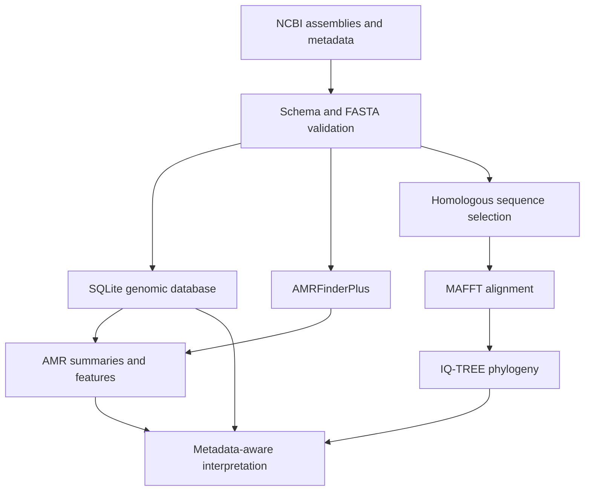

# Analytical workflow

## Quality principles

1. Keep raw inputs unchanged.
2. Validate accessions and required metadata before analysis.
3. Record missingness rather than silently imputing biological metadata.
4. Split modelling data at isolate level and check class balance.
5. Prevent closely related isolates from leaking across evaluation partitions.
6. Report uncertainty and avoid causal or clinical claims.

